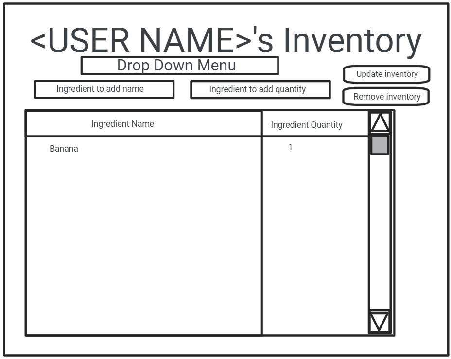

# Design Document

## Instructions

## Mint Chip's Digital Pantry Design

## 1. Problem Statement

MCDP is a service designed to digitize a user's pantry. It allows them to keep an inventory of what is available in their household.

This design document describes the service that will provide the digital pantry functionality to meet our customers' needs. It is designed to contain a pantry, a meal plan, a recipe book, as well as a grocery list function. It will be able to return current items in the pantry, recipes that are in the recipe book, and a grocery list of items needed to create chosen recipes.

## 2. Top Questions to Resolve in Review

1. Scope: How many features should we have? (Current thoughts: Pantry which holds inventory, meal plan which consists of selected recipes, recipe-book which consists of entered recipes, grocery list which is populated by checking meal plan's recipe requirements vs pantry's inventory)
2. How many of the items should be POJOs vs just Strings?
3. Do you know of any other teams out there who are working on related problems? Or might have the same concerns about how to best structure the data for use as well as database storage?
4. Should the User's meal plan be a List of Recipes or just a List of Strings using Recipe Ids?

## 3. Use Cases

U1. As a MCDP customer, I want to create a personal digital pantry

U2. As a MCDP customer, I want to be able to add inventory to my pantry

U3. As a MCDP customer, I want to be able to view recipes in the recipe-book

U4. As a MCDP customer, I want to be able to create a meal plan

U5. As a MCDP customer, I want to be able to select recipes and add it to my meal plan

U6. As a MCDP customer, I want to be able to make a recipe and have it be removed from my meal plan and the ingredients removed from my pantry

U7. As a MCDP customer, I want to be able to view my pantry inventory

U8. As a MCDP customer, I want to be able to have the selected recipe populate my grocery list based off of what is missing from my pantry

U9. As a MCDP customer, I want to be able to change the name of my pantry/pantries

U10. As a MCDP customer, I want to be able to change the name of my meal plan/s


Stretch goals

S1. As a MCDP customer, I want to view my grocery list when I log into the grocery list page

S2. As a MCDP customer, I want to be able to take the items from my grocery list and have them added to the pantry when I purchase them

S3. As a MCDP customer, I want to be able to use any measurement when adding ingredients

S4. As a MCDP customer, I want to be able to add recipes to the recipe book

S5. As a MCDP customer, I want to be able to have a display name separate from my UserId


## 4. Project Scope

### 4.1. In Scope

* Creating, retrieving, and updating a pantry
* Recipe list that can be searched by name, region and dietary restrictions
* Recipes can be retrieved and individual recipes added to meal plan
* A user's meal plan which consists of chosen recipes

### 4.2. Out of Scope

* A grocery list that is created by comparing pantry inventory to meal plan requirements
* A measurement converter
* Ability to add recipes
* Ability to see popular recipes (what is in the cache)

# 5. Proposed Architecture Overview

This initial iteration will provide the minimum lovable product (MLP) including
creating, retrieving, and updating a pantry, as well as retrieving a recipe and adding it to a user's meal plan.

We will use API Gateway and Lambda to create four endpoints (`GetUser`,
`CreateUser`, `UpdateUser`, and `GetRecipes`)
that will handle the creation, update, and retrieval of Users and Recipes to satisfy our
requirements.

We will store recipes available for users in a table in DynamoDB. Users
themselves will also be stored in DynamoDB. For simpler tracking, we
will store the list of pantry items and chosen recipes for a given user directly in the users
table.

Mint Chip's Digital Pantry will also provide a web interface for users to manage
their pantry and meal plan. A main page providing a list view of all of their pantry items
will let them create new items and link off to pages containing recipes to view available recipes
and add them to the user's meal plan.

# 6. API

## 6.1. Public Models

```
// UserModel

String userId;
String displayName;
********List<String> mealPlans; //S = mealPlanId
********List<String> userPantries; //S = pantryId
```

```
// PantryModel

String pantryId;
String pantryName;
String userId;
Set<Ingredient> inventory;

```

```
// MealPlanModel
String mealPlanId;
String mealPlanName;
String userId;
Set<String> recipeSet; //S = recipeId
```

```
// RecipeModel

String recipeId;
String recipeName;
Set<Ingredient> neededIngredients;
String region;
List<Strings> dietaryRestrictions;
```

```
// IngredientModel

String ingredientName;
Double quantity;
Enum unitOfMeasure; (Possibly a stretch goal)
```

## 6.2. Endpoints

### Digital Pantry

* Accepts `POST` requests to `/digitalPantry`
* Accepts a pantryName and userId and returns the corresponding PantryModel including a unique pantryId assigned by the Pantry Service.

* Accepts `GET` requests to `/digitalPantry/{pantryId}`
* Accepts a userId and a pantryId and returns the corresponding PantryModel.

* Accepts `PUT` requests to `/digitalPantry/{pantryId}`
* Accepts data to update a pantry including an updated pantryName.

* Accepts `GET` requests to `/digitalPantry/{pantryId}/inventory`
* Accepts a userId and a pantryId and returns the corresponding inventory of pantry.

* Accepts `PUT` requests to `/digitalPantry/{pantryId}/inventory`
* Accepts data to update a pantry inventory including adding, removing ingredients, or updating an ingredient quantity.

### Recipes

* Accepts `GET` requests to `/recipes/`
* Accepts a recipeId and optional regional filter and dietary filter. Returns corresponding recipes.

### Meal Plans

* Accepts `POST` requests to `/mealPlan`
* Accepts a mealPlanName and userId and returns the corresponding MealPlanModel including a unique mealPlanId assigned by the Meal Plan Service.

* Accepts `GET` requests to `/mealPlan/{mealPlanId}`
* Accepts a userId and a mealPlanId and returns the corresponding MealPlanModel.

* Accepts `PUT` requests to `/mealPlan/{mealPlanId}`
* Accepts data to update a meal plan including an updated mealPlanName.

* Accepts `GET` requests to `/mealPlan/{mealPlanId}/recipeSet`
* Accepts a userId and a mealPlanId and returns the corresponding meal plan recipes.

* Accepts `PUT` requests to `/mealPlan/{mealPlanId}/recipeSet`
* Accepts data to update a mealPlan's recipes, including adding or removing.

### User

* Accepts `POST` requests to `/user`
* Accepts a displayName and unique userId and returns the corresponding UserModel.

* Accepts `PUT` requests to `/user`
* Accepts data to update a displayName.

* Accepts `GET` requests to `/user/{userId}`
* Accepts a userId and returns corresponding user.

# 7. Tables

### 7.1. `digitalPantry`

```
id // partition key, string
pantryName // sort string, string
inventory // map
```

### 7.2. `mealPlans`

```
id // partition key, string
mealPlanName // sort string, string
mealPlan // string set
```

### 7.3. `Recipes`

```
id // partition key, string
name // string
ingredientsList // map
recipe_region // string  recipe_region-recipe-region-index partition key
dietary_needs // string set dietary_needs-dietary-needs-index partition key
```

- `recipe-region-index` includes ALL attributes
- `dietary-needs-index` includes ALL attributes

### 7.4. `User` 

```
userId // partition key, string
displayName // string
```

# 8. Pages



